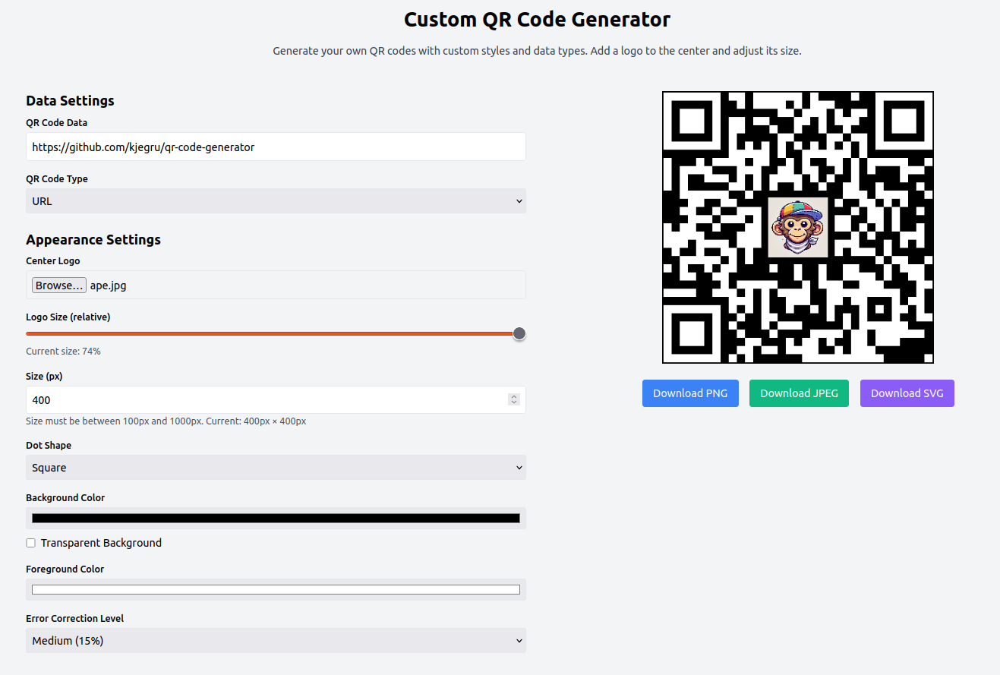

# QR Code Generator

A modern, customizable QR Code Generator built with React, Tailwind CSS, and `qr-code-styling`. The app allows users to dynamically generate QR codes with advanced customization options such as logo uploads, custom colors, sizes, and error correction levels.



---

## Features

1. **General Features:**
   - Interactive form to generate QR codes dynamically.
   - Live preview of the QR code as users customize options.

2. **Customizable Options:**
   - Input field for QR code data (URL, text, email, WiFi credentials, vCard).
   - Dropdown to select QR code type.
   - File upload for a center logo.
   - Controls for:
     - QR code size (width and height).
     - Dot shape (square, rounded, circular, etc.).
     - Background and foreground colors with color pickers.
     - Error correction level (L, M, Q, H).
     - Logo size slider to scale the logo relative to the QR code.
   - Optional background transparency.

3. **Advanced Features:**
   - Supports `.vcf` file uploads for vCard QR codes.
   - Validates input based on QR code type (e.g., URL validation).
   - Export QR codes as PNG, JPEG, or SVG images.

4. **Frontend Design:**
   - Responsive layout using Tailwind CSS.
   - User-friendly interface with clear instructions.

---

## File and Folder Structure

```
qr-code-generator/
├── public/
│   ├── index.html       # The main HTML file where the app is mounted
│   └── favicon.ico      # Favicon for the app
├── src/
│   ├── components/      # Contains reusable React components
│   │   ├── FormControls.jsx  # The form for customizing QR codes
│   │   ├── QRCodeGenerator.jsx  # Main logic for generating QR codes
│   │   └── QRCodePreview.jsx  # Displays live preview and export options
│   ├── App.jsx          # Root component for the app
│   ├── index.js         # Entry point for the React app
│   └── styles.css       # Tailwind CSS styles
├── package.json         # Dependencies and project metadata
├── tailwind.config.js   # Tailwind CSS configuration
├── postcss.config.js    # PostCSS configuration for Tailwind CSS
└── README.md            # Documentation for the app
```

---

## Installation Instructions

### Prerequisites

1. **Node.js**: Version 14 or later.
2. **npm**: Installed with Node.js.

### Steps

1. Clone the repository:
   ```bash
   git clone https://github.com/your-username/qr-code-generator.git
   cd qr-code-generator
   ```

2. Install dependencies:
   ```bash
   npm install
   ```

3. Start the development server:
   ```bash
   npm start
   ```

4. Open your browser and navigate to:
   ```
   http://localhost:3000
   ```

---

## File Descriptions

### **Public Folder**
- **index.html**: The HTML file where the React app is mounted. Contains the root `<div>` for rendering.
- **favicon.ico**: The app's favicon.

### **Source Folder**

#### **Components**
1. **`FormControls.jsx`**:
   - Provides the form controls for customizing the QR code.
   - Includes inputs for data, size, colors, logo upload, and other customization options.

2. **`QRCodeGenerator.jsx`**:
   - Handles the logic for generating the QR code.
   - Updates QR code options dynamically based on user inputs.

3. **`QRCodePreview.jsx`**:
   - Displays the live QR code preview.
   - Provides export buttons for saving the QR code as PNG, JPEG, or SVG.

#### **Other Files**
- **`App.jsx`**:
  - The root component that combines all other components.
  - Contains the main layout of the app.

- **`index.js`**:
  - The entry point for the React app.
  - Renders the `App` component into the DOM.

- **`styles.css`**:
  - Includes Tailwind CSS for styling.

### **Configuration Files**
- **`package.json`**:
  - Lists project dependencies (`react`, `qr-code-styling`, `tailwindcss`, etc.) and scripts (`start`, `build`).

- **`tailwind.config.js`**:
  - Configures Tailwind CSS, including purging unused styles in production.

- **`postcss.config.js`**:
  - Configures PostCSS to work with Tailwind CSS.

---

## Notes
- **Custom Logo:** If the logo appears too small or too large, use the `Logo Size (relative)` slider to scale it proportionally.
- **Canvas Size Errors:** Ensure the QR code size is between 100px and 1000px to avoid rendering errors.
- **Responsive Design:** The app is fully responsive and works across devices.

